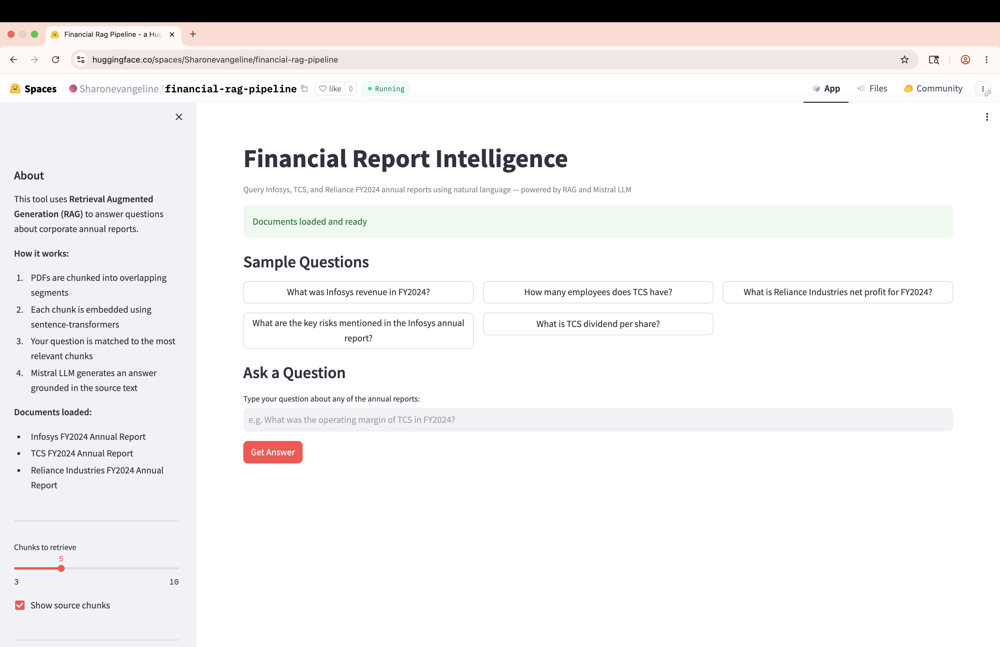
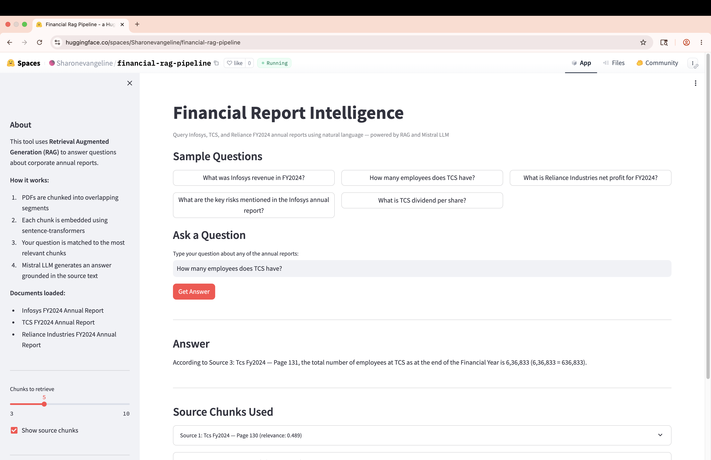
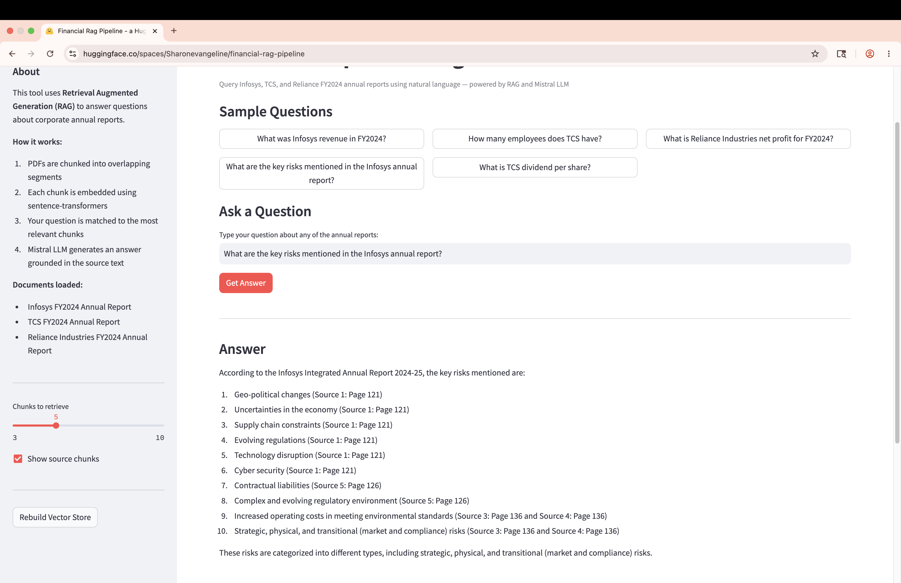
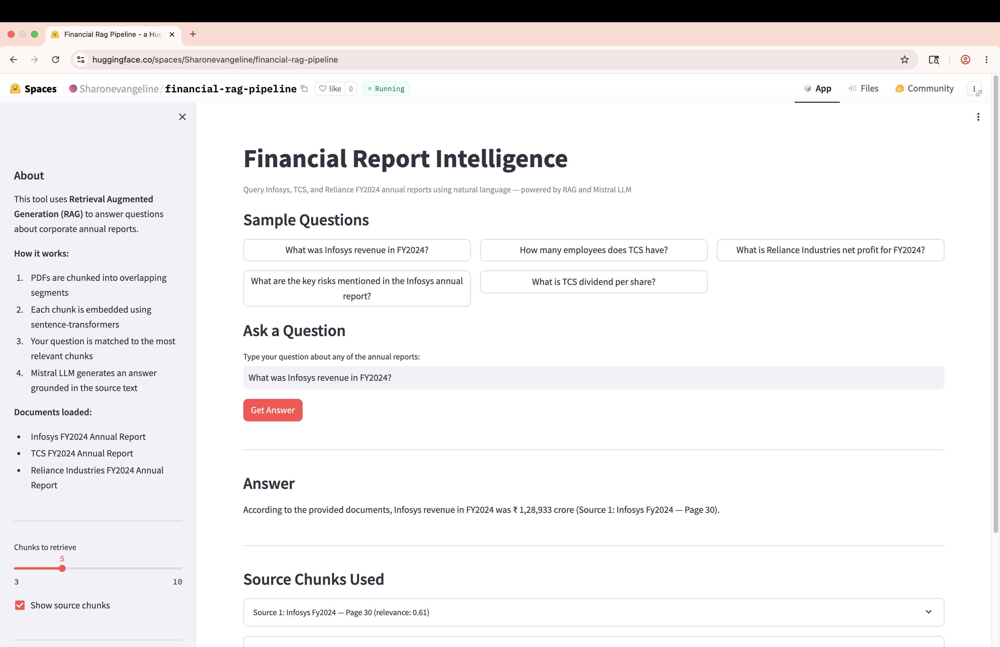

# Financial Report Intelligence — RAG Pipeline

A Retrieval Augmented Generation (RAG) system that enables natural language querying of corporate annual reports. Ask questions in plain English and get answers grounded in the actual source documents, with page-level citations.

## Live Demo
👉 **[Launch App](https://huggingface.co/spaces/Sharonevangeline/financial-rag-pipeline)**

## Screenshots

### Sample questions interface


### Answering a financial query with source citations




## Problem Statement
Financial analysts spend hours manually reading 200-page annual reports to extract key metrics, risks, and performance data. This RAG pipeline reduces that to seconds — a user types a question in plain English and receives a grounded answer with the exact source page cited.

## How It Works
User question
↓
Embedded using sentence-transformers (all-MiniLM-L6-v2)
↓
Semantic search across ChromaDB vector store (4,278 chunks)
↓
Top 5 most relevant chunks retrieved
↓
Chunks + question sent to Llama 3 (via Groq API)
↓
Grounded answer with source page citations

## Documents Loaded
- Infosys FY2024 Annual Report (369 pages)
- TCS FY2024 Annual Report (336 pages)
- Reliance Industries FY2024 Annual Report (146 pages)
- Total: 851 pages → 4,278 overlapping chunks

## Tech Stack
Python · LangChain · ChromaDB · sentence-transformers · Groq (Llama 3) · Streamlit · PyPDF

## Features
- Natural language querying across 3 company annual reports simultaneously
- Semantic search using sentence-transformers embeddings (runs locally, no API needed)
- Source citations with company name and page number for every answer
- Adjustable retrieval depth (3-10 chunks)
- Sample questions for quick exploration
- Chunk overlap strategy to preserve context at boundaries

## Project Structure
financial-rag-pipeline/
├── app.py          ← Streamlit UI and session management
├── ingest.py       ← PDF loading, chunking, ChromaDB ingestion
├── retriever.py    ← Semantic search and context formatting
├── llm.py          ← LLM routing (Ollama locally / Groq deployed)
├── requirements.txt
└── README.md

## Run Locally

```bash
git clone https://github.com/Sharonevangeline/financial-rag-pipeline.git
cd financial-rag-pipeline
pip install -r requirements.txt
```

Add annual report PDFs to the project root:
- `infosys_fy2024.pdf`
- `tcs_fy2024.pdf`
- `reliance_fy2024.pdf`

Run with Ollama (free, local):
```bash
ollama pull mistral
streamlit run app.py
```

Or set `GROQ_API_KEY` in `.env` and set `USE_GROQ=true` for cloud LLM.

## Key Design Decisions
- **Chunk size 1000, overlap 200** — preserves context at boundaries, critical for financial tables and multi-line metrics
- **Dual LLM routing** — same codebase works locally (Ollama/Mistral) and deployed (Groq/Llama3) via a single env variable
- **Force rebuild on HuggingFace** — no persistent storage on free tier, so vector store rebuilds at startup from source PDFs

## Motivation
Built to demonstrate applied NLP and RAG architecture skills — directly relevant to enterprise document processing use cases encountered in data engineering work at Accenture, and to validate the Databricks Generative AI Engineer certification with a production-grade implementation.